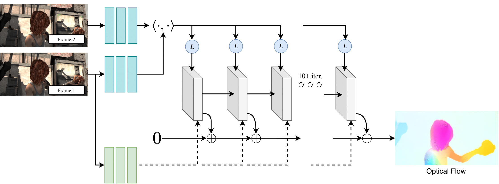

# Computer Vision Project - RAFT for Dense Optical Flow Estimation

This repository is built on top of the official RAFT implementation:

[RAFT: Recurrent All Pairs Field Transforms for Optical Flow](https://arxiv.org/pdf/2003.12039.pdf)<br/>
ECCV 2020<br/>
Zachary Teed and Jia Deng<br/>



## Project Layout

Beyond the original RAFT code, this repository contains our project work on
video edit propagation using dense optical flow.

The project includes:

1. Multiple propagation strategies implemented as separate experiments:
	- direct reference warping with consistency filtering (`demo_direct.py`),
	- pairwise propagation (`demo-pairwise.py`),
	- pairwise robust median-center propagation (`demo-pairwise-median.py`),
	- sequential cumulative flow from reference (`demo-sequential-from-ref.py`),
	- sequential backward composition to reference (`demo-sequential-to-ref.py`).
2. Mask and data preparation tools:
	- mask color inspection (`inspect_mask_color.py`),
	- red/green mask extraction (`extract_red_mask.py`, `extract_green_mask.py`),
	- image resizing helper (`to-half-res.py`, configured for quarter-resolution output).
3. Exporting to video:
	- frame sequence to video conversion (`frames_to_video.py`).

## Project Context

This work was developed as part of the UE Computer Vision course at IMT Atlantique,
with an emphasis on long-term dense motion estimation and edit propagation quality.

## Setup

### RAFT Base Environment

The original RAFT code was tested with PyTorch 1.6 and CUDA 10.1.

```bash
conda create --name raft
conda activate raft
conda install pytorch=1.6.0 torchvision=0.7.0 cudatoolkit=10.1 matplotlib tensorboard scipy opencv -c pytorch
```

## Model Weights

Pretrained models can be downloaded with:

```bash
./download_models.sh
```

Or manually from Google Drive:
[RAFT pretrained models](https://drive.google.com/drive/folders/1sWDsfuZ3Up38EUQt7-JDTT1HcGHuJgvT?usp=sharing)

## Frames, Masks, and Result Videos

You can download frames, masks, and generated result videos from:
[Project data and results (Google Drive)](https://drive.google.com/drive/folders/1SfdsRHnGVoKTo1I6F-J6ZyhfaFTy7bkZ)

Two data workflows are supported:
- Full-resolution workflow:
	1) place full-resolution frames in `test-data/`
	2) place mask and edited reference frame in `test-data-mask/`
	3) run `python to-half-res.py` to generate quarter-resolution frames/mask
	4) run a demo script
- Quarter-resolution workflow:
	1) place quarter-resolution frames directly in `test-data/`
	2) place mask and fer in `test-data-mask/`
	3) run a demo script directly

The same Drive folder also contains result videos so you can compare output quality across methods.

## Quick Start

### Run one of our propagation experiments

```bash
python demo_direct.py
python demo-pairwise.py
python demo-pairwise-median.py
python demo-sequential-from-ref.py
python demo-sequential-to-ref.py
```